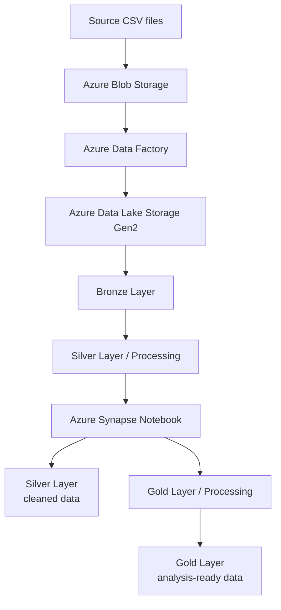

# 🐝 Bee Haven – Architecture

## Overview

Bee Haven follows a Bronze, Silver, and Gold medallion architecture using Azure Data Lake Storage Gen2.

The project combines historical hive sensor data with historical weather data from the Bright Sky Weather API.

## Architecture



## Data Flow

### 1. Source and Ingestion

Historical hive data is provided as CSV files and initially uploaded to Azure Blob Storage.

Azure Data Factory manages the ingestion workflow and moves the files into the Bronze Layer of Azure Data Lake Storage Gen2.

### 2. Bronze Layer

The Bronze Layer contains the raw source files.

Azure Data Factory uses **Get Metadata**, **ForEach**, dynamic content, and pipeline activities to process incoming files. Processed source files are moved from `bronze/new` to `bronze/archive`.

### 3. Silver Layer / Processing

Files prepared for transformation are stored in:

```text
silver/processing/
```

These files are used as input for the Azure Synapse Notebook.

### 4. Azure Synapse Notebook

The Synapse Notebook performs the main data transformation.

It:

* Reads the source files from `silver/processing`
* Cleans and standardises sensor data
* Converts timestamps to UTC
* Removes duplicate records
* Retrieves historical weather data from the Bright Sky Weather API
* Stores cleaned datasets as Parquet files

### 5. Silver Layer

The cleaned sensor and weather datasets are stored in the Silver Layer.

The main datasets include:

* Flow
* Humidity
* Temperature
* Weight
* Weather

### 6. Gold Layer / Processing

Intermediate datasets are written to:

```text
gold/processing/
```

These datasets are used for further downstream transformations.

### 7. Gold Layer

The Gold Layer contains analysis-ready datasets combining hive activity and weather information.

## Azure Services

The project uses:

* **Azure Blob Storage** – initial source file storage
* **Azure Data Factory** – ingestion, orchestration, and Bronze file processing
* **Azure Data Lake Storage Gen2** – Bronze, Silver, and Gold data storage
* **Azure Synapse Analytics** – notebook-based data transformation
* **Bright Sky Weather API** – historical weather data

## Data Formats

| Stage             | Format                |
| ----------------- | --------------------- |
| Source            | CSV                   |
| Bronze            | CSV / raw source data |
| Silver Processing | CSV                   |
| Silver            | Parquet               |
| Gold Processing   | Parquet               |
| Gold              | Parquet               |

## Architecture Principles

The project follows these principles:

* Separate raw, processed, and analysis-ready data
* Preserve raw source files in the Bronze Layer
* Use Azure Data Factory for ingestion and file orchestration
* Perform data transformations in the Azure Synapse Notebook
* Store cleaned datasets in Parquet format
* Keep intermediate Gold processing separate from final Gold datasets
* Combine hive activity and weather data for analysis in the Gold Layer
