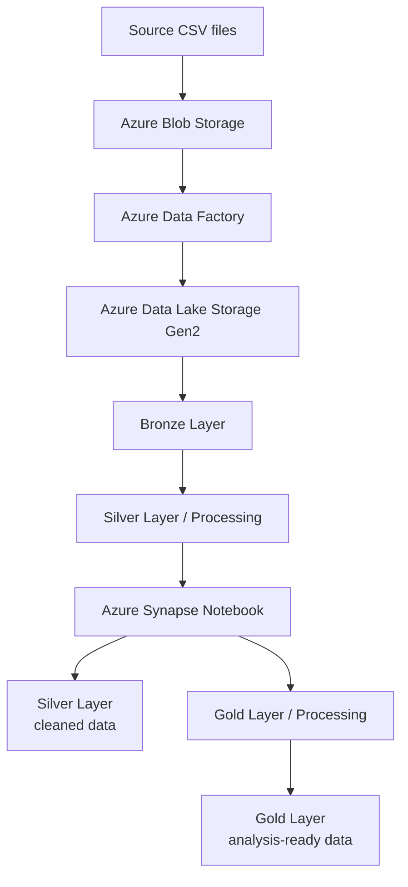

# 🐝 Bee Haven

This repository contains an educational Azure data engineering project developed as part of the WBS Coding School program. The project builds a data pipeline for Bee Haven, a beekeeping project that combines historical hive data with weather data for analysis.

The pipeline uses Azure Data Lake Storage Gen2, Azure Data Factory, Azure Synapse Notebooks, Python, and Parquet. It follows a Bronze, Silver, and Gold data architecture.

## 💾 Dataset

The project uses historical hive activity data provided as CSV files and weather data collected from the BrightSky Weather API.

The data includes hive activity and environmental information. Weather data is retrieved as JSON, cleaned, and stored as Parquet for further processing.

Raw data is kept in the Bronze Layer, cleaned data in the Silver Layer, and analysis-ready data in the Gold Layer.

## 📂 Project Structure

The GitHub repository contains the project documentation, Azure Synapse notebook, and sample source data:

```text
Bee Haven/
├── 1. data/
│   ├── flow_schwartau.csv
│   ├── humidity_schwartau.csv
│   ├── temperature_schwartau.csv
│   └── weight_schwartau.csv
├── 2. notebooks/
│   └── silver_processing_to_silver_and_to_gold_processing.ipynb
├── 3. docs/
│   └── architecture.md
├── .gitignore
├── README.md
└── requirements.txt

```

The Azure Data Lake Storage Gen2 environment uses a separate Bronze, Silver, and Gold structure:

```text
Azure Data Lake Storage Gen2
│
├── bronze/
│   ├── new/
│   └── archive/
│
├── silver/
│   ├── processing/
│   ├── flow/
│   ├── humidity/
│   ├── temperature/
│   ├── weight/
│   └── weather/
│
└── gold/
    ├── processing/
    └── ...
```

The repository contains selected source data and project files, while the Azure environment contains the full data pipeline and medallion architecture.

## ⚙️ Technologies

The project uses:

* Azure Data Lake Storage Gen2 for data storage
* Azure Data Factory for data ingestion, orchestration, and automation
* Azure Synapse Notebooks for data transformation
* Python and pandas for data processing
* Parquet for the Silver and Gold datasets
* BrightSky Weather API for historical weather data
* Azure RBAC/IAM for access management

## 🔄 Data Pipeline

The Bee Haven pipeline follows a Bronze, Silver, and Gold medallion architecture.

The main workflow is:



Azure Data Factory uses Get Metadata, ForEach, dynamic content, and pipeline activities to process and archive incoming files in the Bronze Layer.

Azure Synapse Notebook processes the files from `silver/processing`, cleans and transforms the sensor and weather data, and writes the results to the Silver Layer and Gold / Processing. The Gold Layer contains the final analysis-ready datasets.

## ☁️ Azure Setup

The project requires an Azure environment with:

* An Azure Resource Group
* An Azure Data Lake Storage Gen2 account
* Azure Data Factory
* Azure Synapse Analytics
* Appropriate Azure RBAC permissions

The data lake is organised into `bronze`, `silver`, and `gold` layers.

The pipelines can be scheduled to process new data automatically.

## 📊 Data Processing

The data preparation includes:

* Standardising column names and data types
* Cleaning missing and duplicate values
* Standardising timestamps
* Validating hive identifiers and measurements
* Converting cleaned data to Parquet
* Retrieving and processing weather data from the BrightSky API
* Joining hive activity and weather data for the Gold Layer

## 🧪 Development and Testing

The pipeline was tested with historical data and an additional new data drop to verify that new files could be processed through the automated workflow.

Azure Data Factory monitoring and Synapse logs can be used to investigate pipeline execution, errors, and transformation results.

## 🎓 Project Context

This project was completed as part of the WBS Coding School data engineering curriculum and provides practical experience with Azure data services and concepts relevant to the Microsoft Azure Data Fundamentals (DP-900) certification.
