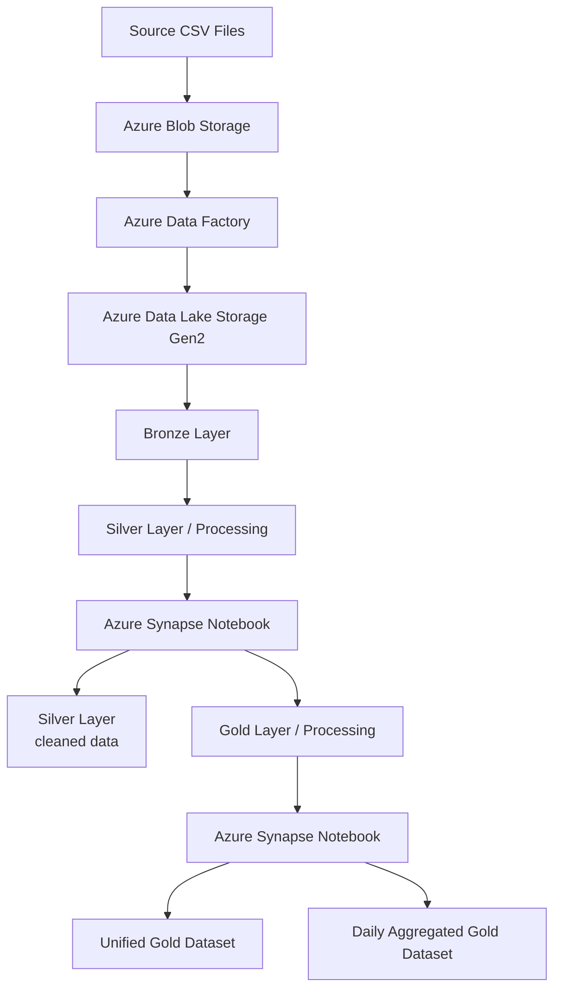

# 🐝 Bee Haven

This repository contains an educational Azure data engineering project developed as part of the **WBS Coding School** program.

The project builds a cloud-based data pipeline for **Bee Haven**, combining historical hive sensor data with historical weather data to create structured datasets for analysis.

The pipeline uses **Azure Data Lake Storage Gen2, Azure Data Factory, Azure Synapse Analytics, Python, pandas, and Parquet** and follows a **Bronze, Silver, and Gold medallion architecture**.

---

## 💾 Dataset

The project uses historical hive activity data provided as CSV files and historical weather data retrieved from the **BrightSky Weather API**.

The hive data includes:

* Flow
* Humidity
* Temperature
* Weight

The weather data provides environmental measurements such as:

* Temperature
* Precipitation
* Pressure
* Sunshine
* Wind
* Cloud cover
* Dew point
* Relative humidity
* Solar radiation

The data is progressively processed through the medallion architecture:

* **Bronze** — raw ingested data
* **Silver** — cleaned and standardised data
* **Gold** — integrated and analysis-ready data

Weather data retrieved from the API is processed and stored in Parquet format for integration with the hive data.

---

## 📂 Project Structure

The GitHub repository contains selected source data, notebooks, documentation, and project configuration files:

```text
Bee Haven/

├── 1. data/
│   ├── schwartau/
│   │    ├── flow_schwartau.csv
│   │    ├── humidity_schwartau.csv
│   │    ├── temperature_schwartau.csv
│   │    └── weight_schwartau.csv
│   └── wurzburg/
│        ├── flow_wurzburg.csv 
│        ├── humidity_wurzburg.csv
│        ├── temperature_wurzburg.csv
│        └── weight_wurzburg.csv
│
├── 2. notebooks/
│   ├── 2.1. silver_processing_to_silver_and_to_gold_processing.ipynb
│   └── 2.2. gold_processing_to_gold.ipynb
│
├── 3. docs/
│   ├── pipeline.png
│   └── WIP.png
│
├── .gitignore
├── README.md
└── requirements.txt
```

The Azure Data Lake Storage Gen2 environment is organised using the following medallion structure:

```text
Azure Data Lake Storage Gen2

│
├── bronze/
│   ├── new/
│   └── archive/
│
├── silver/
│   ├── processing/
│   ├── flow/
│   ├── humidity/
│   ├── temperature/
│   ├── weight/
│   └── weather/
│
└── gold/
    ├── processing/
    └── ... final files
```

The GitHub repository contains selected project files and sample source data, while the Azure environment contains the full data pipeline and cloud-based data layers.

---

## ⚙️ Technologies

The project uses:

* **Azure Data Lake Storage Gen2** — cloud data storage
* **Azure Data Factory** — data ingestion, orchestration, and automation
* **Azure Synapse Analytics** — Spark-based data processing and transformation
* **Python** — data processing and pipeline logic
* **pandas** — data cleaning, transformation, and integration
* **fsspec** — interaction with Azure Data Lake Storage
* **Parquet** — storage format for processed datasets
* **BrightSky Weather API** — historical weather data
* **Azure RBAC/IAM** — access management

---

## 🔄 Data Pipeline

The Bee Haven pipeline follows a **Bronze → Silver → Gold** medallion architecture.

The overall workflow is:



Azure Data Factory uses Get Metadata, ForEach, dynamic content, and pipeline activities to process and archive incoming files in the Bronze Layer.

Azure Synapse Notebook processes the files from `silver/processing`, `gold/processing` cleans and transforms the sensor and weather data, and writes the results to the Silver Layer and Gold / Processing. The Gold Layer contains the final analysis-ready datasets.

### Bronze Layer

Incoming hive data is ingested and stored in the Bronze Layer. Azure Data Factory is used to orchestrate file ingestion and archiving.

### Silver Layer

The Silver processing stage cleans and standardises the hive and weather data.

Processing includes:

* Reading raw data from the Silver processing area
* Cleaning and standardising sensor data
* Converting timestamps to UTC
* Removing duplicate records
* Retrieving and processing corresponding weather data
* Writing processed datasets back to the Silver Layer
* Preparing intermediate datasets for the Gold processing stage

### Gold Layer

The Gold processing stage combines the processed hive and weather datasets by **location and timestamp**.

The Gold notebook:

1. Reads processed Parquet files from `gold/processing`
2. Groups the data by Bee Haven location
3. Merges sensor and weather measurements using timestamps
4. Standardises the Gold dataset structure
5. Creates a unified Gold dataset
6. Creates a daily aggregated Gold dataset
7. Writes both datasets to Azure Data Lake Storage

The Gold processing stage creates two outputs: a **Unified Gold Dataset** containing the integrated sensor and weather data at timestamp level, and a **Daily Aggregated Gold Dataset** summarising the data by location and day.

---

## 📊 Data Processing

The data preparation and integration pipeline includes:

* Standardising sensor measurements and column names
* Cleaning and validating hive data
* Removing duplicate records
* Standardising timestamps
* Converting timestamps from local time to UTC
* Retrieving historical weather data
* Processing weather measurements
* Combining hive and weather data by timestamp
* Separating hive-specific temperature and humidity measurements
* Combining data from the Schwartau and Wurzburg locations
* Storing processed datasets in Parquet format
* Creating daily aggregated Gold data

The resulting Gold dataset provides a unified structure for further analysis and visualisation.

---

## ☁️ Azure Setup

The project requires an Azure environment containing:

* An **Azure Resource Group**
* An **Azure Data Lake Storage Gen2** account
* **Azure Data Factory**
* **Azure Synapse Analytics**
* Appropriate **Azure RBAC permissions**

The data lake is organised into `bronze`, `silver`, and `gold` layers.

The pipelines can be scheduled to process new data automatically.

The Synapse notebooks are designed to run in an **Azure Synapse Spark environment**.

For security, Azure storage credentials and other environment-specific configuration values are **not stored in this repository**. The notebooks use placeholders for environment-specific Azure configuration.

---

## 🧪 Development and Testing

The pipeline was tested with historical hive data and an additional data drop to verify that new files could be processed through the automated workflow.

Azure Data Factory monitoring and Azure Synapse execution logs can be used to investigate:

* Pipeline execution
* File ingestion
* Processing errors
* Transformation results
* Output datasets

---

## 🎓 Project Context

This project was completed as part of the **WBS Coding School Data Engineering curriculum**.

It provides practical experience with:

* Cloud data storage
* Data ingestion and orchestration
* Azure Data Factory
* Azure Synapse Analytics
* Spark-based data processing
* Python and pandas
* Parquet data formats
* Medallion architecture
* Data pipeline automation
* Integration of external API data

The project also provides practical exposure to concepts relevant to the **Microsoft Azure Data Fundamentals (DP-900)** certification.
